# IF3110 Tugas Besar 2 WBD_SPA

## *Tubes2_Kelompok 8_SPA*

## **Table of Contents**
* [Program Description](#program-description)
* [Program Requirement](#program-requirement)
* [Used Packages](#used-packages)
* [Execution Guide](#execution-guide)
* [Implementation Screenshots](#implementation-screenshots)
* [Progress Report](#progress-report)
* [Workload Distribution](#workload-distribution)

## **Program Description**
**InfoAnimeMasseForum** is an web-based application that allows user to have a forum discussion regarding any topic that they want. This program will be supported by the REST protocol from the other repository.

## **Program Requirement**
Here are the requirements to run the program
| Requirements | Reference Link |
|--------------|----------------|
| Nodejs | [Nodejs](https://nodejs.org/en) |
| Docker | [Docker](https://docs.docker.com/desktop/install/windows-install/) |


## **Used Packages**
Here are the packages used in the program
| Packages | Reference Link |
|----------|------------------------|
| ChakraUI | [ChakraUI](https://chakra-ui.com/getting-started) |
| React-router-dom | [React-router-dom](https://www.npmjs.com/package/react-router-dom) |
| React-icons | [React-icons](https://react-icons.github.io/react-icons/) |
| React-alice-carousel | [React-alice-carousel](https://github.com/maxmarinich/react-alice-carousel) |


## **Execution Guide**
1. Clone this repository with the following command
```
https://gitlab.informatika.org/if3110-2023-01-08/if3110-tugas-besar-1-wbd_spa.git
```
2. Change the directory into the cloned directory
3. Start the program with the following command
```
npm start
```
4. The program will be launched on : `http://localhost:3001`

## **Implementation Screenshots**
Will be added later.

### Home Page
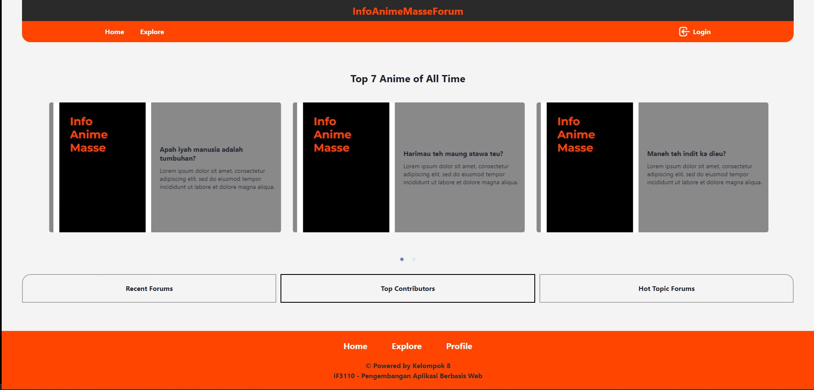

### Login Page
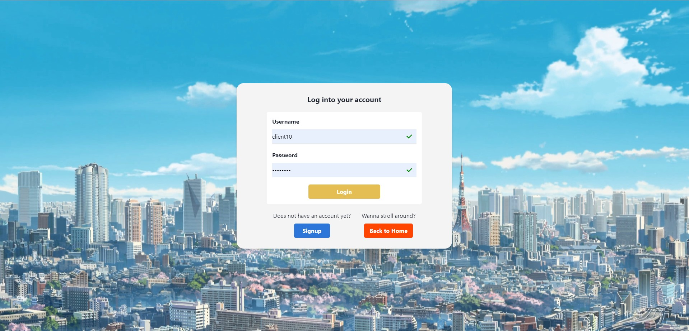

### Signup Page
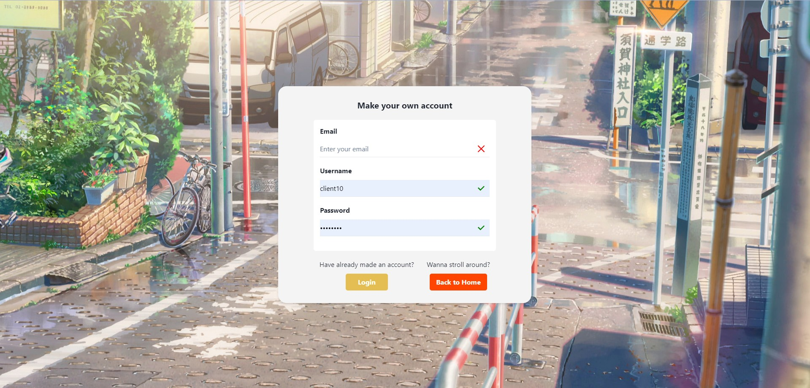

### Profile Page
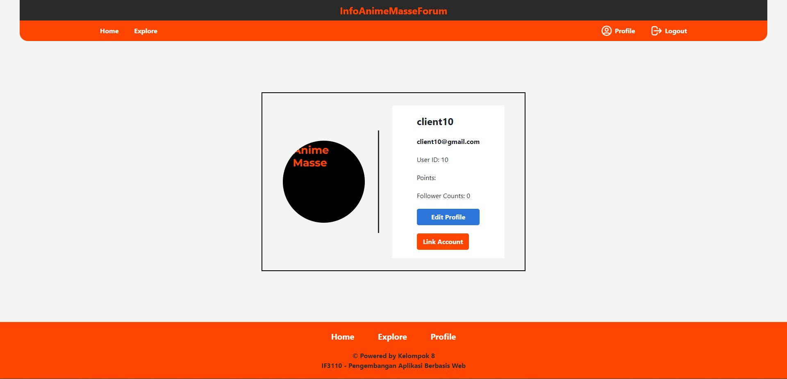

### Reference Page
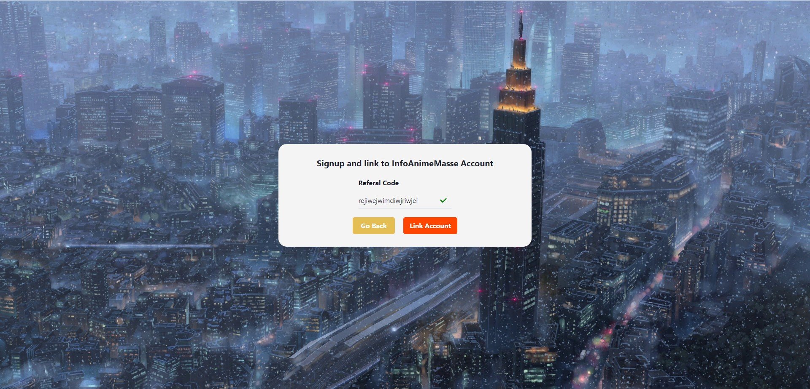

### Forum List Page
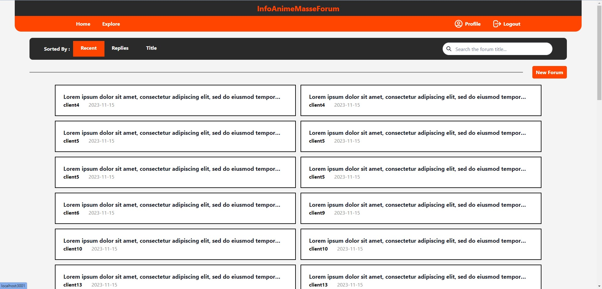

### Forum Detail Page
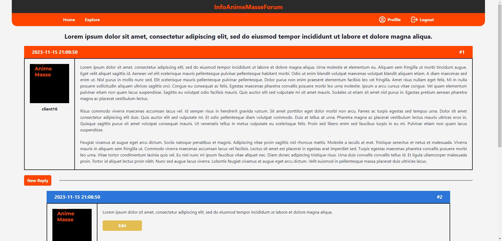

### New Forum Popup
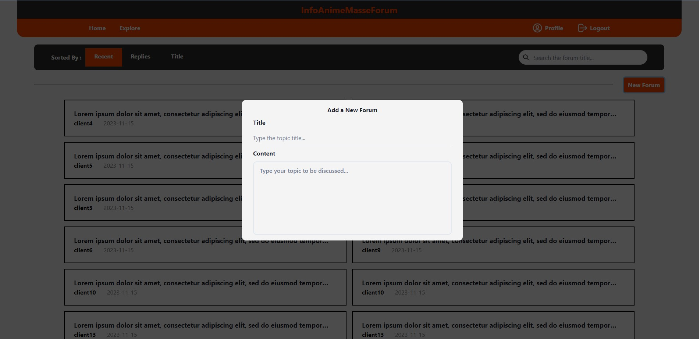

### Add Reply Popup
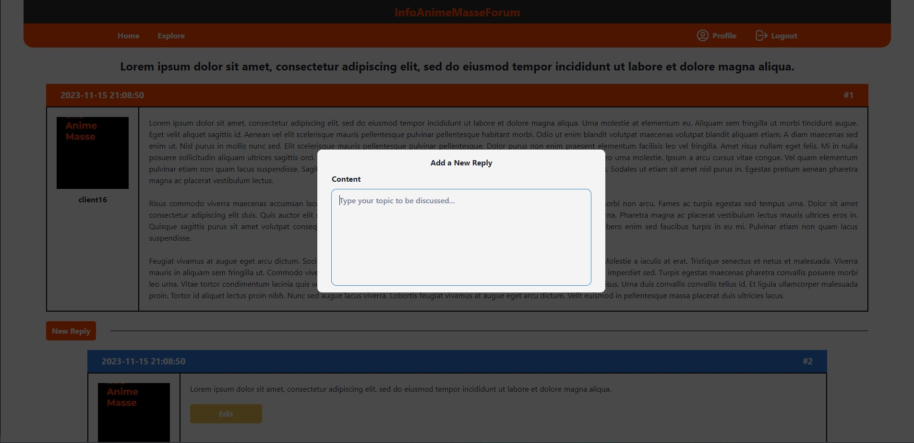

### Edit Reply Popup
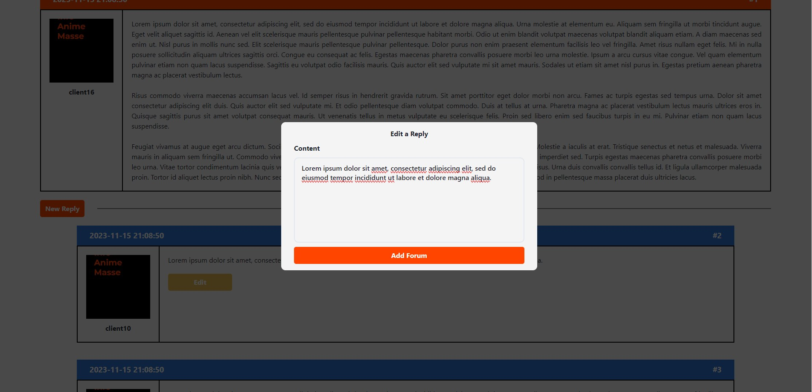

### Not Authorized Page
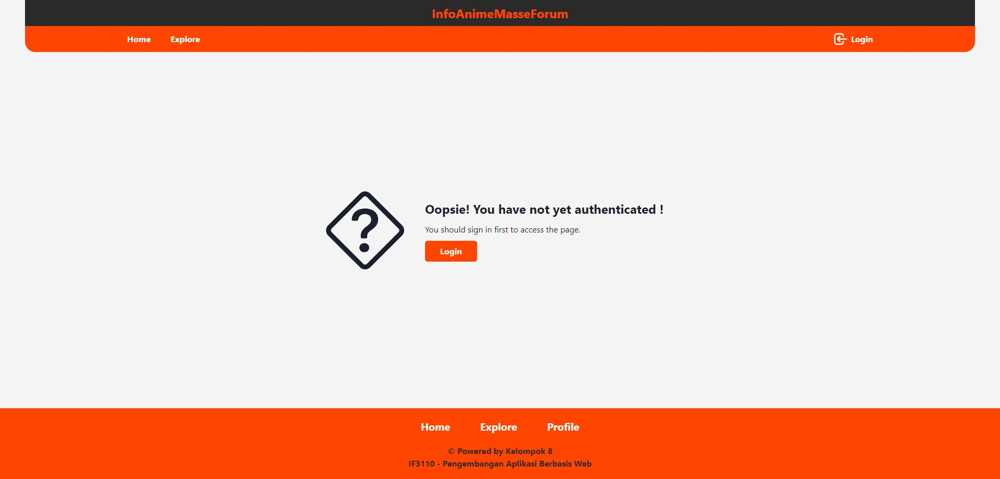

## **Workload Distribution**
| Name                     | Student ID | Functionalities | Display |
|--------------------------|------------|-------------|--------------|
| Irfan                    | 10023176   |  |  |
| Bagas Aryo Seto          | 13521081   | <ul> <li> Forum List Integration <li> Forum Page Integration </ul> |  |
| Juan Christopher Santoso | 13521116   | <ul> <li> Login and Register Integration <li> Authentication Checking Integration <li> Follow and Unfollow Integration <li> Link and Unlink Integration <li> SOAP Connection | All Pages and Components |

